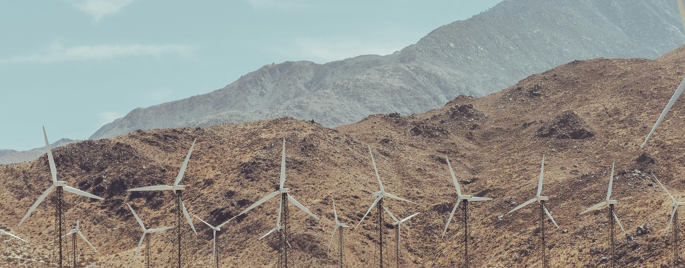

# Distribution System DER Capacity Expansion under Uncertainty: an End-to-End Approach

This project was developed during the internship at Caltech, focusing on the integration of neural networks with optimal power flow (OPF) problems in smart grid systems. The work combines deep learning techniques with convex optimization to solve complex power distribution challenges in electrical grids.

## Overview

This repository implements a decision-aware uncertainty quantification framework for power grid optimization, utilizing parallel LSTM networks for demand forecasting and CVXPY-based optimization for optimal power flow solutions.

### Key Components

- **`trainer.py`**: Implements the neural network training pipeline using parallel LSTMs to predict power demand with uncertainty quantification, integrating with the optimization module for end-to-end learning.

- **`cvxpy_protocol.py`**: Provides the optimal power flow solver using CVXPY optimization, handling three-phase electrical grid constraints, linear distribution flow, and operational limits for Caltech's campus power grid.

## Getting Started

### Environment Setup

1. **Install the environment from YAML:**
   ```bash
   conda env create -f environment.yaml
   conda activate optnn
   ```

2. **Configure the power grid settings:**
   
   Edit `scripts/config.yaml` to modify:
   - Grid topology (`adj_matrix`)
   - Node classifications (`node_class`) 
   - Admittance matrices (`Y_A`)
   - Time periods (`T`)
   - Power demand parameters

3. **Run the training:**
   ```bash
   cd scripts
   python trainer.py
   ```

## Project Structure

- `scripts/`: Main training and optimization code
  - `trainer.py`: Neural network training with LSTM-based demand forecasting
  - `cvxpy_protocol.py`: Optimal power flow optimization solver
  - `config.yaml`: Grid configuration parameters
  - `model.py`: Neural network architecture definitions
  - `data_loader.py`: Data preprocessing and loading utilities

- `data/`: Dataset and configuration files
  - `power_1014-0114_with_weather.csv`: Historical power demand data with weather features
  - `teaser.jpg`: Project visualization

- `decision-aware-uq/`: Additional uncertainty quantification research code

## Features

- **Parallel LSTM Networks**: Multi-variable time series forecasting for power demand
- **Uncertainty Quantification**: Probabilistic predictions with confidence intervals
- **CVXPY Integration**: Seamless integration between neural networks and convex optimization
- **Three-Phase Power Flow**: Complete modeling of three-phase electrical systems
- **Real-time Pricing**: Integration of dynamic electricity pricing in optimization

## Requirements

- Python 3.8+
- PyTorch
- CVXPY
- NumPy
- Matplotlib
- YAML

See `environment.yaml` for complete dependency list.

